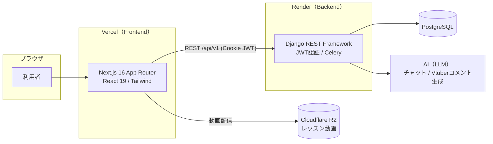

# 基本設計書 — MOMOCRI AI School Platform

| 項目 | 内容 |
|---|---|
| システム名 | MOMOCRI AI School Platform |
| 種別 | AIスクール型オンライン学習SaaS |
| 作成日 | 2026-07-09 |
| 前提 | 実装済みコード（backend / frontend）を正とする |

---

## 1. システム概要

オンラインでコース・レッスンを受講し、動画学習に **AIチャット** と **AI Vtuberによる動画連動コメント** を組み合わせた学習プラットフォーム。受講者の進捗・スキルポイント・バッジによるゲーミフィケーション、法人向けの受講者管理、運営向けの管理ポータルを備える。

### 1.1 目的
- 動画学習の理解を AI アシストで深める（レッスン単位のAIチャット／Vtuberコメント）
- 学習継続をゲーミフィケーション（進捗率・スキルポイント・バッジ）で促進
- 個人（B2C）と法人（B2B）双方の受講形態に対応
- 運営がコース・ユーザー・売上を一元管理

### 1.2 想定ユーザー（ロール）

| ロール | 内部値 | 概要 | 主な利用画面 |
|---|---|---|---|
| 受講者 | `student` | 個人受講者 | 学習ルーム・コース・進捗・コミュニティ |
| 法人管理者 | `corp_admin` | 契約法人の管理担当 | 法人管理・受講者管理・進捗レポート |
| 講師 | `instructor` | コース・レッスン提供者 | （コース保有者。管理系は運営が代行運用） |
| 運営管理者 | `admin` | サービス運営 | 管理ポータル全機能 |

---

## 2. システム構成

- **Frontend**: Next.js 16（App Router）を Vercel にデプロイ。本番ドメインは `ai-school-platform` プロジェクト。
- **Backend**: Django REST Framework を Render にデプロイ（API: `/api/v1/`）。非同期処理に Celery。
- **DB**: PostgreSQL（Render 管理・有料プラン）。
- **動画配信**: Cloudflare R2（レッスン動画）。
- **AI**: レッスンのトランスクリプトを用いた AIチャット応答・Vtuber用時系列コメント生成。

---

## 3. 技術スタック

| 層 | 技術 |
|---|---|
| フロントエンド | Next.js 16 / React 19 / TypeScript / Tailwind CSS / Shadcn UI |
| バックエンド | Django / Django REST Framework / drf-spectacular（OpenAPI） |
| 認証 | SimpleJWT（Cookieベース・access 15分 / refresh rotate） |
| DB | PostgreSQL |
| 非同期 | Celery |
| ストレージ | Cloudflare R2（動画） / Django Media（アバター等） |
| インフラ | Vercel（FE）/ Render（BE・DB） |
| API文書 | Swagger UI（`/api/docs/`）・OpenAPI Schema（`/api/schema/`） |

---

## 4. 機能一覧

| 分類 | 機能 | 対象ロール | 実装状況 |
|---|---|---|---|
| 認証 | 新規登録・ログイン・トークン更新・ログアウト・パスワードリセット | 全員 | 実装済 |
| プロフィール | プロフィール表示・編集（`users/me`） | 全員 | 実装済 |
| コース | コース一覧・詳細閲覧（公開コース） | 受講者 | 実装済 |
| 学習 | 受講登録・レッスン視聴・進捗更新 | 受講者 | 実装済 |
| ゲーミフィケーション | 学習統計・スキルポイント・バッジ | 受講者 | 実装済 |
| AIチャット | レッスン連動AIチャット（ストリーミング）・履歴 | 受講者 | 実装済 |
| AI Vtuber | レッスン動画連動の時系列コメント | 受講者 | 実装済 |
| 通知 | 通知一覧・未読数・既読化 | 全員 | 実装済 |
| サブスク/決済 | サブスク・決済記録・返金申請 | 受講者/運営 | 実装済 |
| コース管理 | コース/章/レッスンのCRUD | 運営 | 実装済 |
| ユーザー管理 | ユーザー一覧・詳細 | 運営 | 実装済 |
| 売上・決済管理 | 売上概況・決済/返金一覧 | 運営 | 実装済 |
| ダッシュボード | 運営ダッシュボード統計 | 運営 | 実装済 |
| 法人管理 | 受講者管理・進捗レポート | 法人管理者 | 画面あり（API拡張余地） |
| コミュニティ/イベント/ポートフォリオ/課題提出 | — | 受講者/運営 | **画面枠あり・APIモデル未実装（今後拡張）** |

> ※ `analytics` / `submissions` / `portfolios` / `community` / `events` の各バックエンドアプリは現状モデル未実装。UI枠のみ存在するため、今後の拡張対象として位置づける。

---

## 5. 非機能設計

### 5.1 認証・セッション
- **SimpleJWT** による JWT 認証。
- アクセストークン **15分** / リフレッシュトークンは **ローテーション有効**（`ROTATE_REFRESH_TOKENS=True`）。
- トークンは **HttpOnly Cookie** で保持。本番はクロスオリジン（Vercel↔Render）のため `AUTH_COOKIE_SECURE=True` / `SAMESITE='None'`。
- 詳細は `02_詳細設計書.md`「認証フロー」参照。

### 5.2 権限モデル
- `User.role` によるロールベースアクセス制御（`admin` / `corp_admin` / `instructor` / `student`）。
- `is_admin_user` / `is_corp_admin` プロパティで判定（`corp_admin` 判定は `admin` を含む）。
- フロントは App Router のルートグループ（`(admin)` / `(corp)` / `(student)` / `(public)`）でレイアウト・導線を分離。

### 5.3 CORS / セキュリティ
- 本番は Vercel（FE）↔ Render（BE）のクロスオリジン構成。CORS 許可とCookie SameSite=None で連携。
- パスワードは Django 標準ハッシュ。

### 5.4 外部連携
- **Cloudflare R2**: レッスン動画配信（`Lesson.video_url`）。
- **AI（LLM）**: `ChatMessage`（対話）と `LessonAIComment`（動画連動コメント）を生成。トークン使用量は `LessonAIComment.input_tokens/output_tokens` に記録。

---

## 6. データ構成概要

主要エンティティは以下。詳細は `03_データベース設計.md` および dbdocs 公開ER図を参照。

- **アカウント**: `organizations`, `users`
- **コンテンツ**: `courses` → `chapters` → `lessons`
- **学習**: `enrollments` → `lesson_progresses`, `skill_points`, `badges`/`user_badges`
- **AI**: `ai_chat_sessions` → `ai_chat_messages`, `ai_lesson_comments`
- **決済**: `subscriptions`, `payments` → `refund_requests`
- **通知**: `notifications`

---

## 7. 関連ドキュメント
- `02_詳細設計書.md` — API・認証フロー・処理フロー
- `03_データベース設計.md` — テーブル定義・ER図（dbdocs）
- `04_画面遷移図.md` — 画面遷移
- `05_ユーザ操作マニュアル.md` — 操作手順
