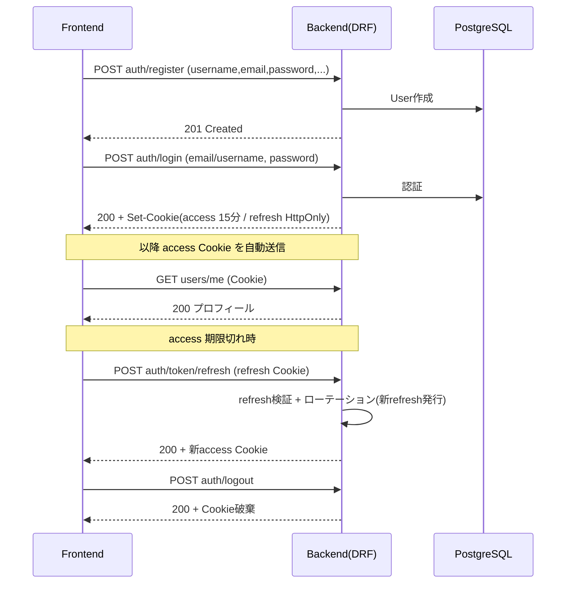
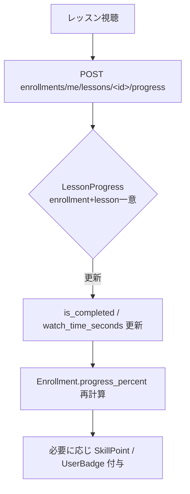
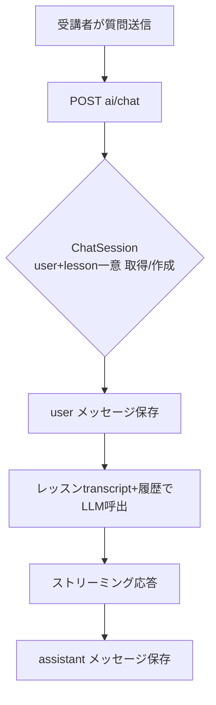

# 詳細設計書 — MOMOCRI AI School Platform

実装（`backend/*/views.py`, `urls.py`）を正とした API・処理フロー・アクセス制御の詳細設計。

---

## 1. API仕様一覧

- ベースURL: `/api/v1/`
- 認証: 特記なきものは **Cookie JWT（IsAuthenticated）** 必須。`AllowAny`=未認証可、`IsAdmin`=運営のみ。

### 1.1 認証・プロフィール（accounts）

| メソッド | パス | 認証 | 概要 |
|---|---|---|---|
| POST | `auth/register/` | AllowAny | 新規ユーザー登録 |
| POST | `auth/login/` | AllowAny | ログイン（JWTをCookie発行） |
| POST | `auth/token/refresh/` | Cookie | リフレッシュトークンでaccess再発行 |
| POST | `auth/logout/` | 認証 | ログアウト（Cookie破棄） |
| GET/PATCH | `users/me/` | 認証 | 自プロフィール取得・更新 |
| GET | `admin/users/` | IsAdmin | ユーザー一覧 |
| GET/PATCH/DELETE | `admin/users/<id>/` | IsAdmin | ユーザー詳細・更新・削除 |

### 1.2 コース（courses）

| メソッド | パス | 認証 | 概要 |
|---|---|---|---|
| GET | `courses/` | AllowAny | 公開コース一覧（ViewSet） |
| GET | `courses/<id>/` | AllowAny | コース詳細（章・レッスン含む） |
| GET/POST | `admin/courses/` | IsAdmin | コース一覧・作成 |
| GET/PATCH/DELETE | `admin/courses/<id>/` | IsAdmin | コース詳細・更新・削除 |
| GET/POST | `admin/courses/<cid>/chapters/` | IsAdmin | 章 一覧・作成 |
| GET/PATCH/DELETE | `admin/courses/<cid>/chapters/<id>/` | IsAdmin | 章 詳細・更新・削除 |
| GET/POST | `admin/courses/<cid>/chapters/<chid>/lessons/` | IsAdmin | レッスン 一覧・作成 |
| GET/PATCH/DELETE | `.../lessons/<id>/` | IsAdmin | レッスン 詳細・更新・削除 |

### 1.3 学習（enrollments）

| メソッド | パス | 認証 | 概要 |
|---|---|---|---|
| GET | `enrollments/me/` | 認証 | 自分の受講一覧 |
| GET | `enrollments/me/stats/` | 認証 | 学習統計 |
| GET | `enrollments/me/skills/` | 認証 | スキルポイント一覧 |
| GET | `enrollments/me/badges/` | 認証 | 獲得バッジ一覧 |
| POST/PATCH | `enrollments/me/lessons/<lesson_id>/progress/` | 認証 | レッスン進捗更新 |

### 1.4 AI（ai）

| メソッド | パス | 認証 | 概要 |
|---|---|---|---|
| POST | `ai/chat/` | 認証 | AIチャット（**ストリーミング応答**） |
| GET | `ai/chat/<lesson_id>/history/` | 認証 | チャット履歴取得 |
| GET | `ai/lessons/<lesson_id>/comments/` | 認証 | AI Vtuber用 時系列コメント取得 |

### 1.5 通知（notifications）

| メソッド | パス | 認証 | 概要 |
|---|---|---|---|
| GET | `notifications/me/` | 認証 | 通知一覧 |
| GET | `notifications/me/unread-count/` | 認証 | 未読数 |
| POST | `notifications/me/read-all/` | 認証 | 全既読化 |
| POST | `notifications/me/<id>/read/` | 認証 | 個別既読化 |

### 1.6 決済・管理（billing / analytics / core）

| メソッド | パス | 認証 | 概要 |
|---|---|---|---|
| GET | `admin/billing/overview/` | IsAdmin | 売上概況 |
| GET | `admin/billing/payments/` | IsAdmin | 決済一覧 |
| GET | `admin/billing/refunds/` | IsAdmin | 返金申請一覧 |
| GET | `admin/dashboard/` | IsAdmin | 運営ダッシュボード統計 |
| GET | `health/` | AllowAny | ヘルスチェック |
| POST | `admin/media/upload/` | 認証 | メディアアップロード |

### 1.7 API ドキュメント
- OpenAPI Schema: `GET /api/schema/`
- Swagger UI: `GET /api/docs/`

---

## 2. 認証フロー

- access 15分 / refresh はローテーション（`ROTATE_REFRESH_TOKENS=True`）。
- 本番はクロスオリジン: `AUTH_COOKIE_SECURE=True`, `SAMESITE='None'`。
- ログインは email / username 両対応（`@` 有無で判定）。

---

## 3. ロール別アクセス制御マトリクス

| 機能領域 | student | corp_admin | instructor | admin |
|---|:--:|:--:|:--:|:--:|
| 公開コース閲覧 | ✓ | ✓ | ✓ | ✓ |
| 受講・進捗・スキル・バッジ | ✓ | ✓ | ✓ | ✓ |
| AIチャット / Vtuberコメント | ✓ | ✓ | ✓ | ✓ |
| 通知 | ✓ | ✓ | ✓ | ✓ |
| 法人管理（受講者/レポート） | — | ✓ | — | ✓ |
| コース/章/レッスン CRUD | — | — | — | ✓ |
| ユーザー管理 | — | — | — | ✓ |
| 売上・決済管理 | — | — | — | ✓ |
| 運営ダッシュボード | — | — | — | ✓ |

> 判定は `core.permissions.IsAdmin`（`role=admin`）と `User.is_corp_admin`（`admin` または `corp_admin`）による。`instructor` の管理系操作は現状 `admin` が代行運用。

---

## 4. 主要処理フロー

### 4.1 レッスン視聴 → 進捗更新

### 4.2 AIチャット（ストリーミング）

### 4.3 AI Vtuber コメント
- `GET ai/lessons/<id>/comments/` で `LessonAIComment.comments`（`[{time_label, text}]`）を取得。
- 動画再生位置に連動して時系列コメントを表示。トークン使用量は `input_tokens/output_tokens` に記録。

---

## 5. モジュール構成（Django apps）

| App | 責務 | 主モデル | 実装 |
|---|---|---|---|
| `core` | 共通基盤（TimestampedModel, permissions, health, media upload） | — | ✓ |
| `accounts` | 認証・ユーザー・組織 | Organization, User | ✓ |
| `courses` | コース・章・レッスン | Course, Chapter, Lesson | ✓ |
| `enrollments` | 受講・進捗・スキル・バッジ | Enrollment, LessonProgress, SkillPoint, Badge, UserBadge | ✓ |
| `ai` | AIチャット・Vtuberコメント | ChatSession, ChatMessage, LessonAIComment | ✓ |
| `billing` | サブスク・決済・返金 | Subscription, Payment, RefundRequest | ✓ |
| `notifications` | アプリ内通知 | Notification | ✓ |
| `analytics` | 分析ダッシュボード | （モデルなし・view のみ） | 一部 |
| `submissions` | 課題提出 | — | **未実装** |
| `portfolios` | ポートフォリオ | — | **未実装** |
| `community` | コミュニティ | — | **未実装** |
| `events` | イベント | — | **未実装** |

> 未実装 app は `urls.py` が空。フロントにUI枠が存在するため、今後モデル・API実装で機能化する拡張対象。

---

## 6. 関連ドキュメント
- `01_基本設計書.md` / `03_データベース設計.md` / `04_画面遷移図.md` / `05_ユーザ操作マニュアル.md`
