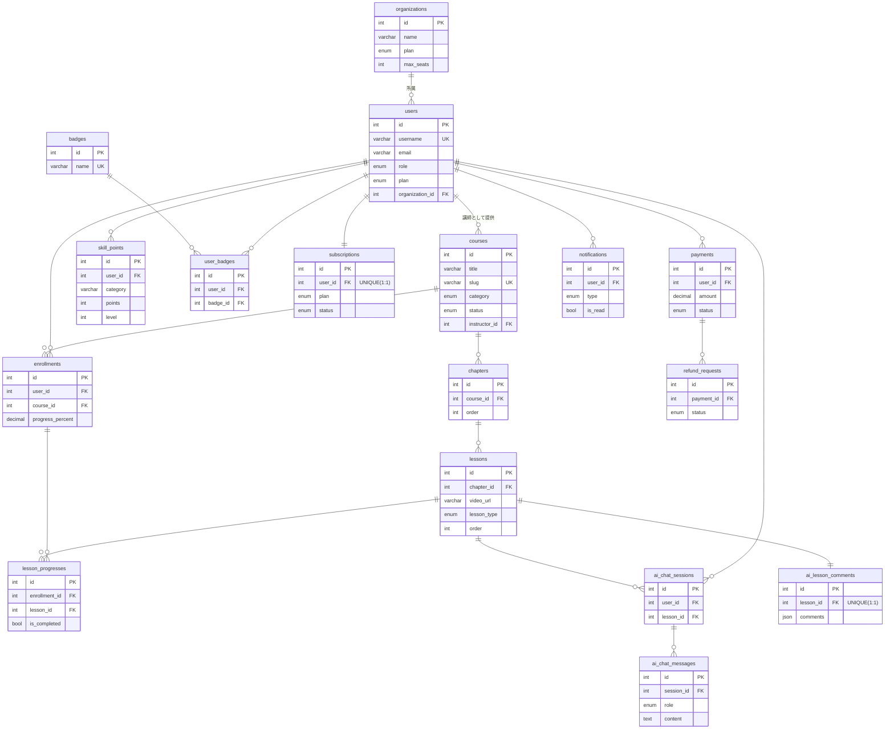

# データベース論理設計（ER図） — MOMOCRI AI School Platform

- DBMS: PostgreSQL
- 原本: `backend/*/models.py`（Django ORM）
- DBMLソース: [`schema.dbml`](./schema.dbml)
- 全テーブルは `created_at` / `updated_at` を持つ（`TimestampedModel` 継承）

---

## 1. dbdocs 公開ER図

DBML から dbdocs.io へ公開したER図を正式版とする。公開手順:

```bash
cd docs/design
dbdocs login                                          # ← 対話操作（Email / Access Token）
dbdocs build schema.dbml --project "MOMOCRI AI School"
```

- **公開ER図URL**: https://dbdocs.io/DOL%20AI/MOMOCRI-AI-School （アカウント: DOL AI）
- ※ 現在 public 公開。必要に応じ `dbdocs password` でアクセス制限を設定
- DBML構文検証: `dbml2sql schema.dbml --postgres`（SQL生成成功を確認済）

> 下記の Mermaid ER図は GitHub / エディタでの即時プレビュー用バックアップ。

---

## 2. ER図（Mermaid）



---

## 3. テーブル定義

各テーブル共通: `id`(PK, auto) / `created_at` / `updated_at`。以下は主要カラムのみ記載。

### organizations（法人組織）
| カラム | 型 | 制約 | 説明 |
|---|---|---|---|
| name | varchar(255) | NOT NULL | 法人名 |
| plan | enum | default business | business / enterprise |
| max_seats | int | default 10 | 契約シート数 |

### users（ユーザー）
| カラム | 型 | 制約 | 説明 |
|---|---|---|---|
| username | varchar(150) | UNIQUE | ログインID |
| email | varchar(254) | | メール |
| role | enum | default student | admin/corp_admin/instructor/student |
| plan | enum | default free | free/pro/business |
| avatar | varchar | NULL | プロフィール画像 |
| bio | text | | 自己紹介 |
| organization_id | FK→organizations | NULL, SET NULL | 所属法人 |

### courses（コース）
| カラム | 型 | 制約 | 説明 |
|---|---|---|---|
| title | varchar(255) | NOT NULL | タイトル |
| slug | varchar(255) | UNIQUE | URLスラッグ |
| category | enum | | design/dev/ai/business |
| difficulty | enum | default beginner | beginner/intermediate/advanced |
| status | enum | default draft | draft/published/hidden |
| instructor_id | FK→users | CASCADE | 講師 |
| duration_hours | decimal(5,1) | | 総時間 |
| tags | json | | タグ配列 |
| language | varchar(10) | default ja | 言語 |

### chapters（章）
| カラム | 型 | 制約 | 説明 |
|---|---|---|---|
| course_id | FK→courses | CASCADE | 所属コース |
| title | varchar(255) | NOT NULL | 章タイトル |
| order | int | UNIQUE(course_id,order) | 並び順 |

### lessons（レッスン）
| カラム | 型 | 制約 | 説明 |
|---|---|---|---|
| chapter_id | FK→chapters | CASCADE | 所属章 |
| title | varchar(255) | NOT NULL | タイトル |
| video_url | varchar | | 動画URL（R2） |
| transcript | text | | 文字起こし（AI用） |
| duration_seconds | int | default 0 | 尺（秒） |
| lesson_type | enum | default video | video/article/quiz/exercise |
| order | int | UNIQUE(chapter_id,order) | 並び順 |

### enrollments（受講登録）
| カラム | 型 | 制約 | 説明 |
|---|---|---|---|
| user_id | FK→users | CASCADE | 受講者 |
| course_id | FK→courses | CASCADE | コース |
| progress_percent | decimal(5,2) | default 0 | 進捗率 |
| — | — | UNIQUE(user_id,course_id) | 二重受講防止 |

### lesson_progresses（レッスン進捗）
| カラム | 型 | 制約 | 説明 |
|---|---|---|---|
| enrollment_id | FK→enrollments | CASCADE | 受講登録 |
| lesson_id | FK→lessons | CASCADE | レッスン |
| is_completed | bool | default false | 完了 |
| watch_time_seconds | int | default 0 | 視聴秒数 |
| — | — | UNIQUE(enrollment_id,lesson_id) | |

### skill_points（スキルポイント）
| カラム | 型 | 制約 | 説明 |
|---|---|---|---|
| user_id | FK→users | CASCADE | ユーザー |
| category | varchar(50) | | スキル分類 |
| points / level | int | | ポイント / レベル |
| — | — | UNIQUE(user_id,category) | |

### badges / user_badges（バッジ）
- `badges`: `name`(UNIQUE), `description`, `icon`
- `user_badges`: `user_id`(FK), `badge_id`(FK), `earned_at`, UNIQUE(user_id,badge_id)

### ai_chat_sessions / ai_chat_messages / ai_lesson_comments（AI）
- `ai_chat_sessions`: `user_id`(FK), `lesson_id`(FK), UNIQUE(user_id,lesson_id)
- `ai_chat_messages`: `session_id`(FK), `role`(user/assistant), `content`
- `ai_lesson_comments`: `lesson_id`(**1:1 UNIQUE**), `comments`(json `[{time_label,text}]`), `input_tokens`, `output_tokens`

### subscriptions / payments / refund_requests（決済）
- `subscriptions`: `user_id`(**1:1**), `plan`, `status`(active/canceled/past_due), `current_period_end`
- `payments`: `user_id`(FK), `amount`(decimal10,0=円), `plan`, `method`, `status`(success/failed/refunded)
- `refund_requests`: `payment_id`(FK), `reason`, `status`(pending/approved/rejected)

### notifications（通知）
| カラム | 型 | 制約 | 説明 |
|---|---|---|---|
| user_id | FK→users | CASCADE | 宛先 |
| type | enum | default system | system/course/instructor/event/feedback |
| title | varchar(255) | NOT NULL | 件名 |
| message / link | text / varchar | | 本文 / 遷移先 |
| is_read | bool | default false | 既読 |
| — | — | INDEX(user_id,is_read) | 未読取得高速化 |

---

## 4. リレーション要点
- `organizations 1—N users`（法人内メンバー、`SET NULL`）
- `users 1—N courses`（講師）→ `courses 1—N chapters 1—N lessons`（3階層コンテンツ）
- `users N—N courses`（`enrollments` 経由）→ `enrollments 1—N lesson_progresses`
- ゲーミフィケーション: `users 1—N skill_points` / `users N—N badges`（`user_badges`）
- AI: `users×lessons 1—N ai_chat_sessions 1—N ai_chat_messages` / `lessons 1—1 ai_lesson_comments`
- 決済: `users 1—1 subscriptions` / `users 1—N payments 1—N refund_requests`
- 通知: `users 1—N notifications`

---

## 5. 対象外（今後拡張）
`submissions` / `portfolios` / `community` / `events` はモデル未実装。機能化時に本設計へ追記する。
