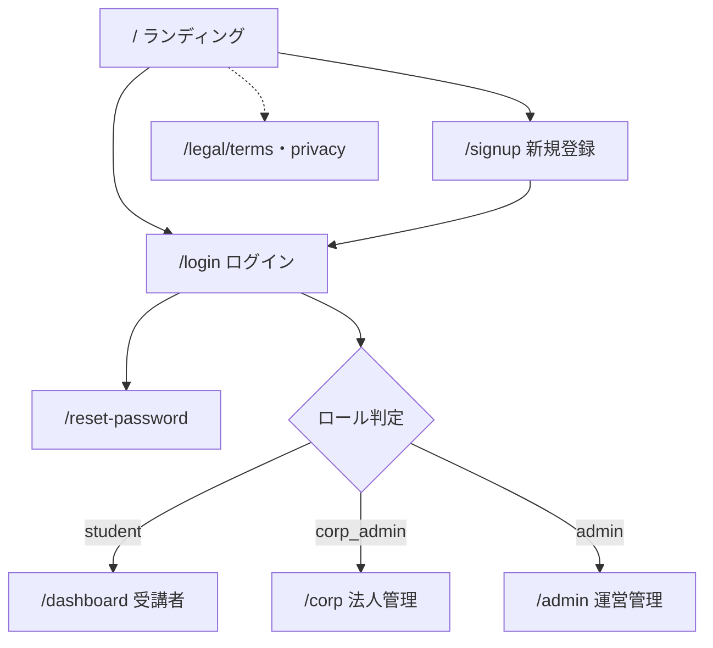
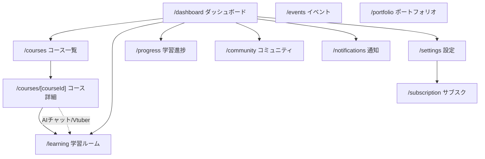
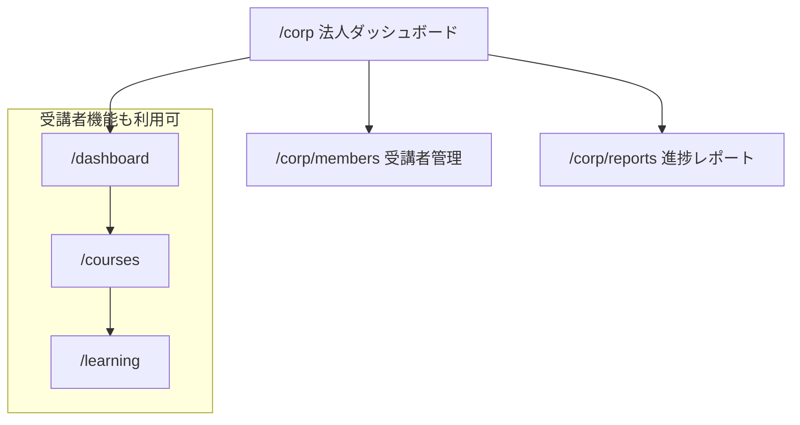
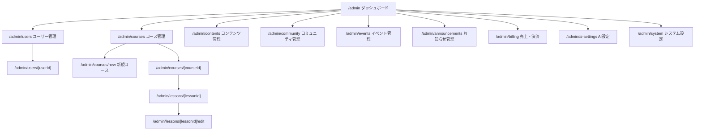

# 画面遷移図 — MOMOCRI AI School Platform

原本: `frontend/src/app/**/page.tsx`（Next.js App Router）、`components/layouts/*-sidebar.tsx`。
ルートグループ: `(public)` / `(student)` / `(corp)` / `(admin)`。

---

## 1. 全体遷移（ログイン→ロール振り分け）

- 未認証で閲覧可能: `/`, `/login`, `/signup`, `/reset-password`, `/legal/*`（`middleware.ts` の `publicPaths`）。
- それ以外は認証必須。ロールに応じて `(student)` / `(corp)` / `(admin)` レイアウトへ。

---

## 2. 受講者（student）遷移

- サイドバー導線: ダッシュボード / 学習ルーム / コース一覧 / コミュニティ / 設定。
- 学習ルーム（`/learning`）でレッスン動画視聴＋**AIチャット**＋**AI Vtuberコメント**。
- コース一覧 → コース詳細 → 受講開始 → 学習ルーム、が主動線。

---

## 3. 法人管理者（corp_admin）遷移

- サイドバー導線: ダッシュボード / 学習ルーム / コース一覧 ＋ 法人管理（法人ダッシュボード / 受講者管理 / 進捗レポート）。

---

## 4. 運営管理者（admin）遷移

- サイドバー10項目: ダッシュボード / ユーザー管理 / コース管理 / コンテンツ管理 / コミュニティ管理 / イベント管理 / お知らせ管理 / 売上・決済 / AI設定 / システム設定。
- コース管理 → コース詳細 → レッスン → 編集、でコンテンツをCRUD。

---

## 5. 画面一覧（ルート対応表）

| グループ | パス | 画面 |
|---|---|---|
| public | `/` | ランディング |
| public | `/login` `/signup` `/reset-password` | 認証 |
| public | `/legal/terms` `/legal/privacy` | 規約・プライバシー |
| student | `/dashboard` | ダッシュボード |
| student | `/learning` | 学習ルーム（動画+AI） |
| student | `/courses` `/courses/[courseId]` | コース一覧・詳細 |
| student | `/community` `/events` `/portfolio` | コミュニティ・イベント・ポートフォリオ |
| student | `/progress` `/notifications` `/subscription` `/settings` | 進捗・通知・サブスク・設定 |
| corp | `/corp` `/corp/members` `/corp/reports` | 法人ダッシュ・受講者・レポート |
| admin | `/admin` ほか10画面 | 運営管理ポータル |

> `community` / `events` / `portfolio` は画面枠のみで、バックエンドAPIは今後拡張。
